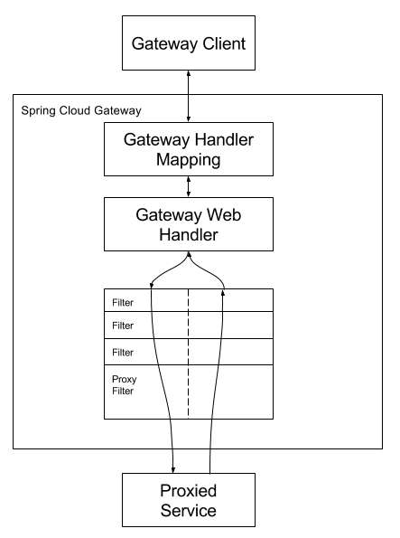

# **Spring Cloud Gateway**

This project provides an API Gateway built on top of the Spring Ecosystem, including: Spring 5, Spring Boot 2 and Project Reactor. Spring Cloud Gateway aims to provide a simple, yet effective way to route to APIs and provide cross cutting concerns to them such as: security, monitoring/metrics, and resiliency.

## 1. How to Include Spring Cloud Gateway

   To include Spring Cloud Gateway in your project, use the starter with a group ID of org.springframework.cloud and an artifact ID of spring-cloud-starter-gateway. See the Spring Cloud Project page for details on setting up your build system with the current Spring Cloud Release Train.

If you include the starter, but you do not want the gateway to be enabled, set spring.cloud.gateway.enabled=false.

## 2. Glossary

   Route: The basic building block of the gateway. It is defined by an ID, a destination URI, a collection of predicates, and a collection of filters. A route is matched if the aggregate predicate is true.

Predicate: This is a Java 8 Function Predicate. The input type is a Spring Framework ServerWebExchange. This lets you match on anything from the HTTP request, such as headers or parameters.

Filter: These are instances of Spring Framework GatewayFilter that have been constructed with a specific factory. Here, you can modify requests and responses before or after sending the downstream request.

## 3. How It Works

   The following diagram provides a high-level overview of how Spring Cloud Gateway works:

Spring Cloud Gateway Diagram
Clients make requests to Spring Cloud Gateway. If the Gateway Handler Mapping determines that a request matches a route, it is sent to the Gateway Web Handler. This handler runs the request through a filter chain that is specific to the request. The reason the filters are divided by the dotted line is that filters can run logic both before and after the proxy request is sent. All “pre” filter logic is executed. Then the proxy request is made. After the proxy request is made, the “post” filter logic is run.

## 4. Configuring Route Predicate Factories and Gateway Filter Factories

   There are two ways to configure predicates and filters: shortcuts and fully expanded arguments. Most examples below use the shortcut way.

The name and argument names will be listed as code in the first sentance or two of the each section. The arguments are typically listed in the order that would be needed for the shortcut configuration.

